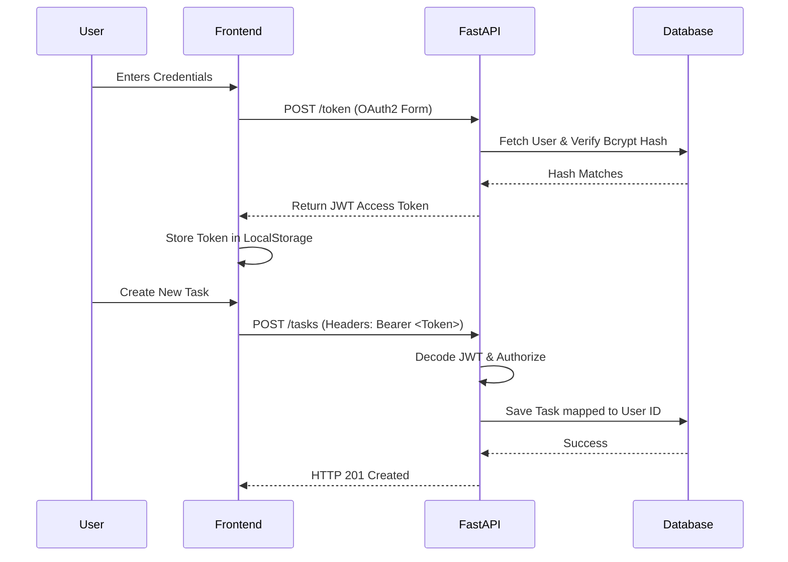

<div align="center">


<h1>⚡ Secure RESTful API Service</h1>

<p>
  <b>A brutally fast, secure, and modern Task Management architecture built on FastAPI.</b>
</p>

<p>
  
  
  
  
</p>

</div>

---

## 🌌 The Vision

The **FastAPI Task Manager** is a highly-optimized, secure backend service wrapped in a beautifully minimalistic vanilla JavaScript frontend. It is designed to demonstrate stateless authentication, row-level data isolation, and blistering fast API routing without the heavy overhead of modern frontend frameworks.

> **Engineering Note:** This application has been meticulously refactored and pinned to specific dependencies to guarantee backward compatibility with **Python 3.6**, proving that modern API architectures can still run seamlessly on legacy environments.

---

## ⚡ Core Architecture

<table align="center">
  <tr>
    <td align="center" width="50%">
      
      <h3>High-Performance Routing</h3>
      <p>Powered by FastAPI and Starlette, delivering NodeJS-level speed with automatic Swagger UI documentation.</p>
    </td>
    <td align="center" width="50%">
      
      <h3>Stateless Security</h3>
      <p>Implements robust OAuth2 Password Bearer flows with Bcrypt hashed passwords and JWT token validation.</p>
    </td>
  </tr>
  <tr>
    <td align="center">
      
      <h3>Row-Level Isolation</h3>
      <p>Strict SQLAlchemy ORM filtering ensures users have zero-knowledge access to anything outside their own tasks.</p>
    </td>
    <td align="center">
      
      <h3>Minimal SaaS Aesthetic</h3>
      <p>A server-side rendered Jinja2 interface featuring a dynamic Dark/Light mode toggle powered by native CSS variables.</p>
    </td>
  </tr>
</table>

---

## 🔐 Authentication Flow

<div align="center">



</div>

---

## 🚀 Ignition Sequence (Setup Guide)

<details>
<summary><b>Click here to view installation & deployment instructions</b></summary>
<br>

### 1. Clone the Repository
```bash
git clone https://github.com/TarakShetti/FastAPI-task-manager.git
cd FastAPI-task-manager
```

### 2. Initialize Virtual Environment
```bash
python -m venv venv

# Windows:
venv\Scripts\activate

# macOS/Linux:
source venv/bin/activate
```

### 3. Install Dependencies
```bash
pip install -r requirements.txt
```

### 4. Launch the Server
Start the FastAPI server using Uvicorn:
```bash
uvicorn main:app --reload
```

</details>

---

## 💻 Interactive Dashboards

Once the server is running, navigate to the following endpoints:

* 🌐 **Application UI:** [http://127.0.0.1:8000](http://127.0.0.1:8000)
* 📖 **Swagger API Docs:** [http://127.0.0.1:8000/docs](http://127.0.0.1:8000/docs)
* 📘 **ReDoc API Docs:** [http://127.0.0.1:8000/redoc](http://127.0.0.1:8000/redoc)

---

<div align="center">
  <p><i>Fast APIs. Secure Tokens. Elegant UIs.</i></p>
  
</div>
